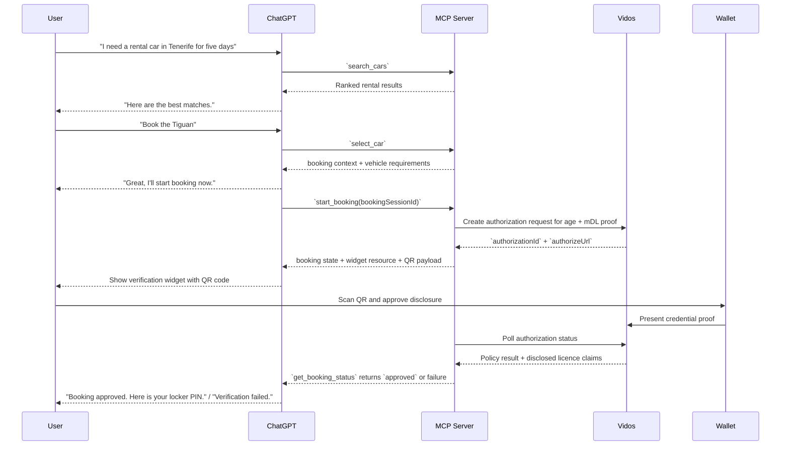
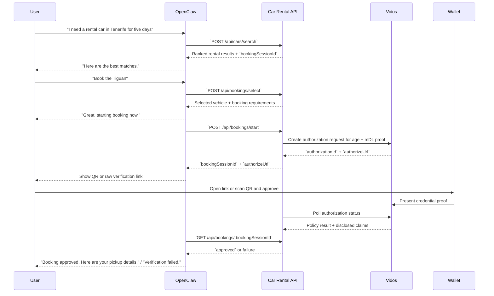

# MCP Car Rental Agent Demo

This demo shows a text-first car-rental concierge with one critical trust step: proving age and driving-licence eligibility before pickup is confirmed.

It is built to demonstrate two integration surfaces over the same domain logic:

- `MCP` for ChatGPT-style hosts
- `HTTP API` for OpenClaw-style agents

The core story is simple: search for a rental in chat, choose a car, start booking, verify eligibility with a wallet, then receive pickup details.

## Hosted Demo URLs

- HTTP API base URL: `https://mcp-car-rent.demo.vidos.id`
- MCP server URL: `https://mcp-car-rent.demo.vidos.id/mcp`

The hosted deployment is the default target for the setup guide and the OpenClaw skill.

## What The Demo Proves

- Conversational travel booking can stay mostly in chat
- A regulated eligibility check can be isolated into a minimal verification handoff
- The same backend flow can support both MCP-native and plain HTTP agents
- Age and driving-licence checks can be done with Vidos and EUDI Wallet credentials without turning the whole experience into a traditional rental SPA

## Demo Flow

1. The agent helps the user search rental cars for a destination and trip context.
2. The agent presents ranked options and the user chooses one vehicle.
3. Booking starts for that vehicle.
4. Because the rental requires age and licence checks, the backend creates a Vidos authorization.
5. The user verifies identity and driving entitlement in a wallet flow.
6. The backend evaluates the result and updates booking status.
7. The agent confirms approval or explains failure.

## MCP Flow

In MCP mode, the journey stays in chat and only the verification step becomes UI. The diagram below keeps the user story concrete while also showing the MCP and Vidos handoff.

## Regular API Flow

In HTTP mode, OpenClaw drives the same backend through JSON endpoints instead of MCP tools. The user journey stays similar, but the agent is responsible for presenting the verification URL or QR step itself.

## MCP Surface

The MCP server exposes these tools:

- `search_cars`
- `select_car`
- `start_booking`
- `get_booking_status`

The key MCP-specific detail is that `start_booking` is linked to a UI resource. That lets the host render a verification widget inline when booking needs wallet proof, while all other steps remain text-first.

## API Surface

The HTTP API exposes the same journey as endpoints:

- `POST /api/cars/search`
- `POST /api/bookings/select`
- `POST /api/bookings/start`
- `GET /api/bookings/:bookingSessionId`

In this mode, the backend returns the authorization URL and booking state. The consuming agent is responsible for how it renders or narrates the verification step.

## Verification Model

This demo keeps verification intentionally narrow:

- rentals are treated as eligibility-gated bookings
- booking creates a Vidos authorization request
- the backend monitors authorization status asynchronously
- on success, the backend reads disclosed credential claims
- eligibility is evaluated against minimum driver age, required licence category, and licence validity
- booking resolves to `approved`, `rejected`, `expired`, or `error`

## Why The Design Is Intentionally Minimal

- `Text-first`: keeps the agent experience conversational
- `Single-purpose UI`: only the QR verification step needs visual interaction in MCP mode
- `Shared backend`: both MCP and HTTP flows reuse the same booking and verification logic
- `High signal demo`: the interesting part is the regulated booking handoff, not storefront polish
- `Tight state model`: booking sessions and verification state are server-side and in-memory, which keeps the demo easy to inspect

## Takeaway

This is not a full rental platform. It is a focused demonstration of how an agent can own search, selection, and booking orchestration, while handing off one trust-critical step - age and driving-licence verification - to a wallet-backed identity flow with minimal UI.
