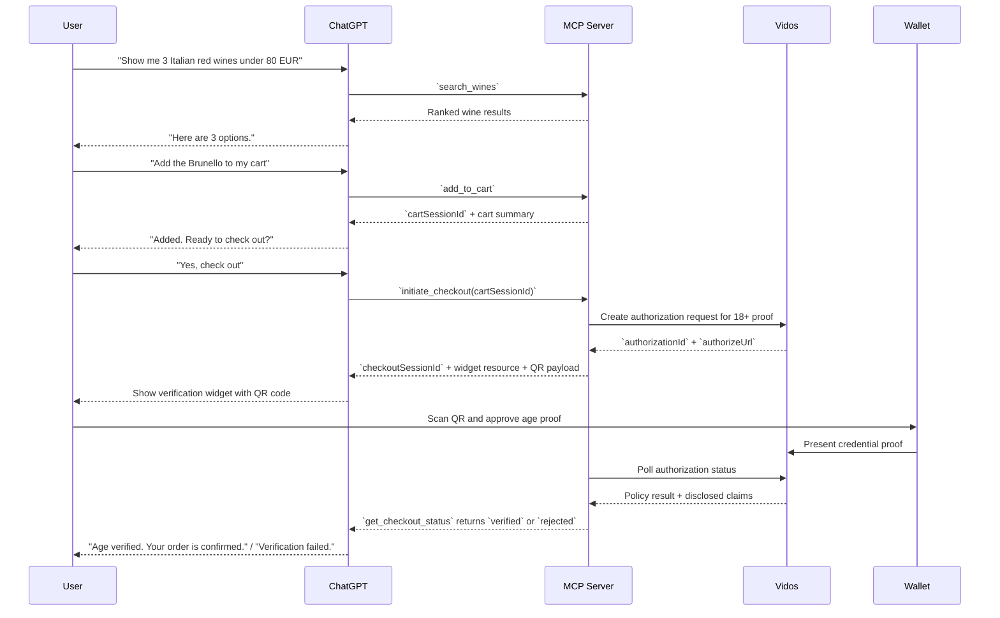
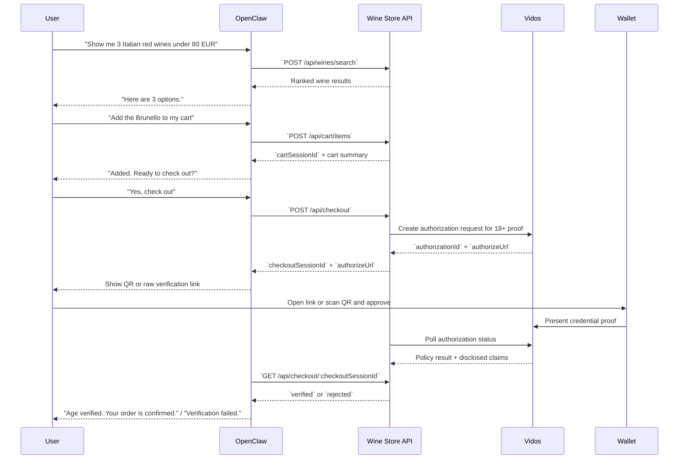

# MCP Wine Agent Demo

This demo shows a text-first wine shopping agent with one critical trust step: age verification for checkout.

It is built to demonstrate two integration surfaces over the same domain logic:

- `MCP` for ChatGPT-style hosts
- `HTTP API` for OpenClaw-style agents

The core story is simple: discover wine in chat, build a cart, trigger checkout, verify age with a wallet, then complete the order.

## Hosted Demo URLs

- HTTP API base URL: `https://mcp-wine-agent.demo.vidos.id`
- MCP server URL: `https://mcp-wine-agent.demo.vidos.id/mcp`

The hosted deployment is the default target for the setup guide and the OpenClaw skill.

## What The Demo Proves

- Conversational commerce can stay mostly in chat
- A regulated step can be isolated into a minimal verification UI
- The same backend flow can support both MCP-native and plain HTTP agents
- Age verification can be done with Vidos and EUDI Wallet credentials without turning the whole experience into a traditional web app

## Demo Flow

1. The agent helps the user search the wine catalog.
2. The agent adds one or more wines to a server-side cart.
3. Checkout starts from that cart.
4. Because wine is age-restricted, the backend creates a Vidos authorization.
5. The user verifies age in a wallet flow.
6. The backend evaluates the result and updates checkout status.
7. The agent confirms success or rejection.

## MCP Flow

In MCP mode, the shopping journey stays in chat and only the verification step becomes UI. The diagram below keeps the user story concrete while also showing the MCP and Vidos handoff.

## Regular API Flow

In HTTP mode, OpenClaw drives the same backend through JSON endpoints instead of MCP tools. The user journey stays similar, but the agent is responsible for presenting the verification URL or QR step itself.

## MCP Surface

The MCP server exposes these tools:

- `search_wines`
- `add_to_cart`
- `remove_from_cart`
- `get_cart`
- `initiate_checkout`
- `get_checkout_status`

The key MCP-specific detail is that `initiate_checkout` is linked to a UI resource. That lets the host render a verification widget inline when checkout needs age proof, while all other steps remain text-first.

## API Surface

The HTTP API exposes the same journey as endpoints:

- `POST /api/wines/search`
- `POST /api/cart/items`
- `GET /api/cart/:cartSessionId`
- `DELETE /api/cart/:cartSessionId/items/:wineId`
- `POST /api/checkout`
- `GET /api/checkout/:checkoutSessionId`

In this mode, the backend returns the authorization URL and checkout state. The consuming agent is responsible for how it renders or narrates the verification step.

## Verification Model

This demo keeps verification intentionally narrow:

- wine purchases are treated as age-restricted
- checkout creates a Vidos authorization request
- the backend monitors authorization status asynchronously
- on success, the backend reads disclosed credential claims
- eligibility is evaluated against an `18+` threshold
- checkout resolves to `verified`, `rejected`, `expired`, or `error`

## Why The Design Is Intentionally Minimal

- `Text-first`: keeps the agent experience conversational
- `Single-purpose UI`: only the QR verification step needs visual interaction
- `Shared backend`: both MCP and HTTP flows reuse the same cart and checkout logic
- `High signal demo`: the interesting part is the regulated checkout handoff, not storefront polish
- `Tight state model`: carts and checkout sessions are server-side and in-memory, which keeps the demo easy to inspect

## Takeaway

This is not a full commerce app. It is a focused demonstration of how an agent can own product discovery and checkout orchestration, while handing off one trust-critical step - age verification - to a wallet-backed identity flow with minimal UI.
